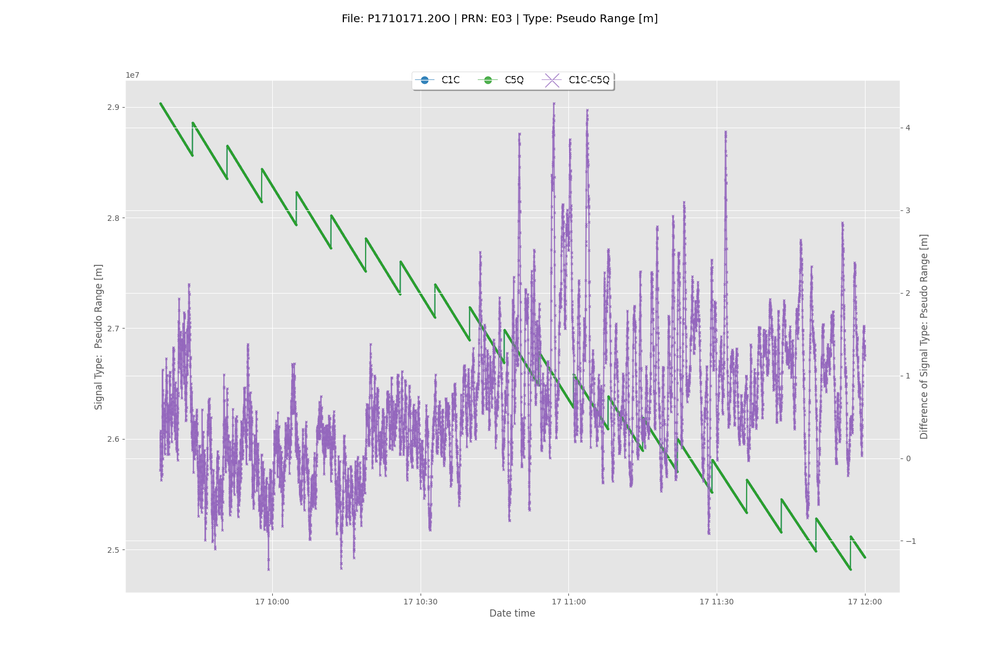
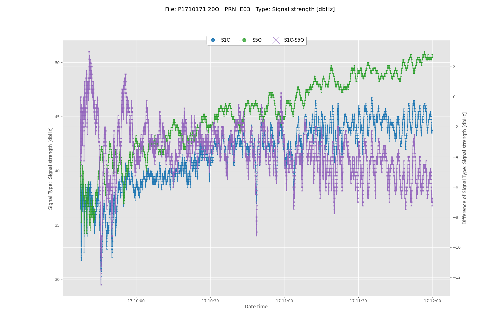

# Python scripts for RINEX examination

## Overview

Python scripts in this environment have been developed using the open source program [gfzrnx](http://dataservices.gfz-potsdam.de/panmetaworks/showshort.php?id=escidoc:1577894), _RINEX GNSS Data Conversion and Manipulation Toolbox_,  a software toolbox for Global Navigation Satellite System (GNSS) data provided in the REceiver Independent EXchange format (RINEX) of the major versions 2 and 3.

The following RINEX data types are supported:

- Observation data
- Navigation data
- Meteorological data

The following global and regional satellite systems are supported:

- GPS - Global Positioning System (USA)
- GLONASS - GLObal NAvigation Satellite System (RUS)
- BEIDOU - Chinese Global and Regional Navigation Satellite System (CHN)
- GALILEO - European Global Navigation Satellite System
- IRNSS - Indian Regional Naviagation Satellite System (IND)
- QZSS - Quasi Zenith Satellite System (JAP)

The following operations/tasks are supported:

- RINEX data check and repair
- RINEX data format conversion ( version 3 to 2 and vice versa )
- RINEX data splice
- RINEX data split
- RINEX data statistics generation
- RINEX data manipulations like: (1) data sampling, (2) observation types selection, (3) satellite systems selection, (4) elimination of overall empty or sparse observation types
- Automatic version dependent file naming on output data
- RINEX data header editing
- RINEX data meta data extraction
- RINEX data comparison

Following scripts have been developed:

- __`pyrnxobsinfo.py`__ scans the RINEX observation header and reports information what is available in the RINEX observation file under investigation.
- __`pygfzrnx.py`__ plots selected observables for selected GNSS and PRNs as well as differences between similar observation types.

## Script `pyrnxobsinfo.py`

\scriptsize

```bash
[amuls:~/amPython/pyGFZRNX] [pyGFZRNX] $ pyrnxobsinfo.py --help
usage: pyrnxobsinfo.py [-h] -r OBSRNX [-d DIRRNX] [-i INTERVAL]
                       [-l LOGGING LOGGING]

pyrnxobsinfo.py reads RINEX observation files and lists available information

optional arguments:
  -h, --help            show this help message and exit
  -r OBSRNX, --obsRnx OBSRNX
                        rinex observation file
  -d DIRRNX, --dirRnx DIRRNX
                        Directory of SBF file (default ./)
  -i INTERVAL, --interval INTERVAL
                        interval in sec for scanning observation file (default
                        600 s)
  -l LOGGING LOGGING, --logging LOGGING LOGGING
                        specify logging level console/file (default INFO
                        DEBUG)
```

\normalsize

The following information, logged in file `pyrnxobsinfo.log`, is returned by `pyrnxobsinfo.py` when the command given is

\tiny

```bash
$ pyrnxobsinfo.py -d ${HOME}/amPython/pyGFZRNX/data/ -r P1710171.20O -i 300
```

Content in `pyrnxobsinfo.log`

```bash
INFO: location.py - locateProg: locate programs gfzrnx
INFO: location.py - locateProg: gfzrnx is /home/amuls/bin/gfzrnx
INFO: location.py - locateProg: locate programs grep
INFO: location.py - locateProg: grep is /bin/grep
INFO: pyrnxobsinfo.py - checkArguments: working directory is /home/amuls/amPython/pyGFZRNX/data
INFO: pyrnxobsinfo.py - checkArguments: changed to directory /home/amuls/amPython/pyGFZRNX/data
INFO: pyrnxobsinfo.py - checkArguments: RINEX observation file P1710171.20O accessible
INFO: rnx_obs_header.py - rnxobs_header_metadata: Running:
/home/amuls/bin/gfzrnx -meta basic:jsonp -finp P1710171.20O -fout /tmp/72321050443b466fbe37434692ce07d5.json
INFO: rnx_obs_header.py - rnxobs_parse_prns: Running:
/home/amuls/bin/gfzrnx -stk_epo 300 -finp P1710171.20O -fout /tmp/f67c033b08c44b75953e4db96f253192.prns
INFO: {func:s}: display of observation time span
INFO: 
INFO:  STT 20200117 06:00   06:40   07:20   08:00   08:40   09:20   10:00   10:40   11:20   12:00   
INFO:  STH            +---+---+---+---+---+---+---+---+---+---+---+---+---+---+---+---+---+---+
INFO:  STE SEPT E E01 |   |*********************************************************  |   |   | E01
INFO:  STE SEPT E E03 |   |   |   |   |   |   |   |   |   |   |  *****************************| E03
INFO:  STE SEPT E E04 **********************************************************  |   |   |   | E04
INFO:  STE SEPT E E05 |   |   | **************************************************************| E05
INFO:  STE SEPT E E09 ************************************************************************| E09
INFO:  STE SEPT E E11 ************************************|   |   |   |   |   |   |   |   |   | E11
INFO:  STE SEPT E E12 **************  |   |   |   |   |   |   |   |   |   |   |   |   |   |   | E12
INFO:  STE SEPT E E13 |   |   |   |   |   |   |   |   |   |   |   |   |   |*******************| E13
INFO:  STE SEPT E E14 ******************************* |   |   |   |   |   |   |   |   |   |   | E14
INFO:  STE SEPT E E15 |   |   |   |   |   |   |   |*******************************************| E15
INFO:  STE SEPT E E19 *********************   |   |   |   |   |   |   |   |   |   |   |   |   | E19
INFO:  STE SEPT E E21 ****************************************|   |   |   |   |   |   |   |   | E21
INFO:  STE SEPT E E24 |   |   |   |   |   |   |   |   | **************************************| E24
INFO:  STE SEPT E E25 |   |   |   |   |   |   |   |   |   |   |   |   |   |   ****************| E25
INFO:  STE SEPT E E27 ****************|   |   |   |   |   |   |   |   |   |   |   |   |   |   | E27
INFO:  STS            |---|---|---|---|---|---|---|---|---|---|---|---|---|---|---|---|---|---|
INFO:  STE SEPT G G01 *************   |   |   |   |   |   |   |   |   |   |   |   |   |   |   | G01
INFO:  STE SEPT G G02 |   *********************************************************** |   |   | G02
INFO:  STE SEPT G G03 **********************************  |   |   |   |   |   |   |   |   |   | G03
INFO:  STE SEPT G G04 *********************************************** |   |   |   |   |   |   | G04
INFO:  STE SEPT G G05 |   |   |   |   |   | **************************************************| G05
INFO:  STE SEPT G G06 *****************************************************   |   |   |   |   | G06
INFO:  STE SEPT G G07 |   |   |***************************************************************| G07
INFO:  STE SEPT G G08 |   |   |   |   |   |   |   |   |   |   |   |   |   |   ****************| G08
INFO:  STE SEPT G G09 *************************************************************** |   |   | G09
INFO:  STE SEPT G G11 **  |   |   |   |   |   |   |   |   |   |   |   |   |   |   |   |   |   | G11
INFO:  STE SEPT G G12 |****   |   |   |   |   |   |   |   |   |   |   |   |   |   |   |   |   | G12
INFO:  STE SEPT G G13 |   |   |   |   |   |   |   |   |  *************************************| G13
INFO:  STE SEPT G G15 |   |   |   |   |   |   |   |   |   |   |   |   | **********************| G15
INFO:  STE SEPT G G16 |   |   |   |   |***********************************|   |   |   |   |   | G16
INFO:  STE SEPT G G17 ********************|   |   |   |   |   |   |   |   |   |   |   |   |   | G17
INFO:  STE SEPT G G19 **************************  |   |   |   |   |   |   |   |   |   |   |   | G19
INFO:  STE SEPT G G20 |   |   |   |   |   |   |   |   |   |   |   |   |   |   |   |   |   |***| G20
INFO:  STE SEPT G G21 |   |   |   |   |   |   |   |   |   |   |   |   | **********************| G21
INFO:  STE SEPT G G22 *********************** |   |   |   |   |   |   |   |   |   |   |   |   | G22
INFO:  STE SEPT G G23 **************************************************  |   |   |   |   |   | G23
INFO:  STE SEPT G G24 |   |   |   |   |   |   |   |   |   |   |   |   |   |   |   |   |   |  *| G24
INFO:  STE SEPT G G25 | ********  |   |   |   |   |   |   |   |   |   |   |   |   |   |   |   | G25
INFO:  STE SEPT G G26 |   |   |   ****************************|   |   |   |   |   |   |   |   | G26
INFO:  STE SEPT G G27 |   |   |   |   |   |   |   |   |   |   |   |   |  ****** **************| G27
INFO:  STE SEPT G G28 |   |   |   |   |   |   |   |   |   |   |   |  *************************| G28
INFO:  STE SEPT G G29 |   |   |   |   |   |   |************************   |   |   |   |   |   | G29
INFO:  STE SEPT G G30 |   |   |   |   |   ****************************************************| G30
INFO:  STE SEPT G G31 *****************   |   |   |   |   |   |   |   |   |   |   |   |   |   | G31
INFO:  STH            +---+---+---+---+---+---+---+---+---+---+---+---+---+---+---+---+---+---+
INFO:  STT 20200117 06:00   06:40   07:20   08:00   08:40   09:20   10:00   10:40   11:20   12:00   
INFO: rnx_obs_header.py - rnxobs_parse_prns: list of PRNs with observations
   E01, E03, E04, E05, E09, E11, E12, E13, E14, E15, E19, E21, E24, E25, E27, G01, G02, G03, G04, G05, G06, G07, G08, G09, G11, G12, G13, G15, G16, G17, G19, G20, G21, G22, G23, G24, G25, G26, G27, G28, G29, G30, G31
INFO: rnx_obs_header.py - rnxobs_metadata_parser: Available 
   GNSS: G
      frequencies: 1, 2, 5
      observation types: C, D, L, S
      observation codes: C1C, C1W, C2L, C2W, C5Q, D1C, D2L, D2W, D5Q, L1C, L2L, L2W, L5Q, S1C, S1W, S2L, S2W, S5Q
      PRNs (#28): G01, G02, G03, G04, G05, G06, G07, G08, G09, G11, G12, G13, G15, G16, G17, G19, G20, G21, G22, G23, G24, G25, G26, G27, G28, G29, G30, G31
INFO: rnx_obs_header.py - rnxobs_metadata_parser: Available 
   GNSS: E
      frequencies: 1, 5
      observation types: C, D, L, S
      observation codes: C1C, C5Q, D1C, D5Q, L1C, L5Q, S1C, S5Q
      PRNs (#15): E01, E03, E04, E05, E09, E11, E12, E13, E14, E15, E19, E21, E24, E25, E27
INFO: pyrnxobsinfo.py - main: info dictionary = 
{
    'info': {
        'header': {
            'antenna': {
                'height': {
                    'e': 0,
                    'h': 0,
                    'n': 0
                },
                'name': 'Unknown',
                'number': 'Unknown',
                'radome': 'NONE'
            },
            'data': {
                'epoch': {
                    'first': '2020 01 17 06 00 00.0000000',
                    'last': '2020 01 17 11 59 59.0000000'
                }
            },
            'exec': {
                'date': '2020-03-25 14:01:30 UTC',
                'meta': 'basic',
                'name': 'gfzrnx',
                'version': '1.12-7747'
            },
            'file': {
                'duration': '86400',
                'epo_first': '2020 01 17 06 00 00.0000000',
                'epo_first_name': '2020 01 17 00 00 00.0000000',
                'interval': '1.000',
                'md5': '1d24cfe740065f076796822841d13087',
                'name': 'P1710171.20O',
                'pgm': 'sbf2rin-13.4.3',
                'pgm_date': '20200317 143355 UTC',
                'pgm_runby': '',
                'satsys': 'GE',
                'site': 'P171',
                'source': 'R',
                'sysfrq': {
                    'E': [
                        '1',
                        '5'
                    ],
                    'G': [
                        '1',
                        '2',
                        '5'
                    ]
                },
                'sysobs': {
                    'E': [
                        'C1C',
                        'C5Q',
                        'D1C',
                        'D5Q',
                        'L1C',
                        'L5Q',
                        'S1C',
                        'S5Q'
                    ],
                    'G': [
                        'C1C',
                        'C1W',
                        'C2L',
                        'C2W',
                        'C5Q',
                        'D1C',
                        'D2L',
                        'D2W',
                        'D5Q',
                        'L1C',
                        'L2L',
                        'L2W',
                        'L5Q',
                        'S1C',
                        'S1W',
                        'S2L',
                        'S2W',
                        'S5Q'
                    ]
                },
                'system': 'M',
                'systyp': {
                    'E': [
                        'C',
                        'D',
                        'L',
                        'S'
                    ],
                    'G': [
                        'C',
                        'D',
                        'L',
                        'S'
                    ]
                },
                'type': 'O',
                'version': '3.04'
            },
            'receiver': {
                'firmware': '2.3.4',
                'name': 'SEPT ASTERX3',
                'number': '3000221'
            },
            'site': {
                'agency': 'Unknown',
                'name': 'P171',
                'number': 'Unknown',
                'observer': 'Unknown',
                'position': {
                    'x': '4023741.4621',
                    'y': '309110.9488',
                    'z': '4922723.5932'
                }
            }
        },
        'prns': [
            'E01',
            'E03',
            'E04',
            'E05',
            'E09',
            'E11',
            'E12',
            'E13',
            'E14',
            'E15',
            'E19',
            'E21',
            'E24',
            'E25',
            'E27',
            'G01',
            'G02',
            'G03',
            'G04',
            'G05',
            'G06',
            'G07',
            'G08',
            'G09',
            'G11',
            'G12',
            'G13',
            'G15',
            'G16',
            'G17',
            'G19',
            'G20',
            'G21',
            'G22',
            'G23',
            'G24',
            'G25',
            'G26',
            'G27',
            'G28',
            'G29',
            'G30',
            'G31'
        ]
    },
    'args': {
        'dir': '/home/amuls/amPython/pyGFZRNX/data/',
        'obs_name': 'P1710171.20O',
        'interval': 300
    },
    'progs': {
        'gfzrnx': '/home/amuls/bin/gfzrnx',
        'grep': '/bin/grep'
    }
}
```

\normalsize

The most interesting information is in the part:

\tiny

```
INFO: rnx_obs_header.py - rnxobs_metadata_parser: Available 
   GNSS: G
      frequencies: 1, 2, 5
      observation types: C, D, L, S
      observation codes: C1C, C1W, C2L, C2W, C5Q, D1C, D2L, D2W, D5Q, L1C, L2L, L2W, L5Q, S1C, S1W, S2L, S2W, S5Q
      PRNs (#28): G01, G02, G03, G04, G05, G06, G07, G08, G09, G11, G12, G13, G15, G16, G17, G19, G20, G21, G22, G23, G24, G25, G26, G27, G28, G29, G30, G31
INFO: rnx_obs_header.py - rnxobs_metadata_parser: Available 
   GNSS: E
      frequencies: 1, 5
      observation types: C, D, L, S
      observation codes: C1C, C5Q, D1C, D5Q, L1C, L5Q, S1C, S5Q
      PRNs (#15): E01, E03, E04, E05, E09, E11, E12, E13, E14, E15, E19, E21, E24, E25, E27
```

\normalsize


## Scripts `pyrnx1obs.py`

This scripts plots for selected GNSS systems, selected PRNs and selected observation types and plots per PRN these observables and if possible their differences.

\tiny

```bash
[amuls:~/amPython/pyGFZRNX/scripts] [pyGFZRNX] $ pyrnx1obs.py --help
usage: pyrnx1obs.py [-h] -r OBSRNX [-d DIRRNX] [-o {C,S,D,L} [{C,S,D,L} ...]]
                    [-s {E,G} [{E,G} ...]] [-f FREQS [FREQS ...]]
                    [-p PRN [PRN ...]] [-i INTERVAL] [-l LOGGING LOGGING]

pyrnx1obs.py reads 1 RINEX observation file and creates / plots observables
(including differences)

optional arguments:
  -h, --help            show this help message and exit
  -r OBSRNX, --obsRnx OBSRNX
                        rinex observation file
  -d DIRRNX, --dirRnx DIRRNX
                        Directory of SBF file (default ./)
  -o {C,S,D,L} [{C,S,D,L} ...], --obs_type {C,S,D,L} [{C,S,D,L} ...]
                        select observation types to plot (default C)
  -s {E,G} [{E,G} ...], --sat_syst {E,G} [{E,G} ...]
                        select GNNSs (default to E)
  -f FREQS [FREQS ...], --freqs FREQS [FREQS ...]
                        select frequency bands (default to all)
  -p PRN [PRN ...], --prn PRN [PRN ...]
                        select PRNs (default all)
  -i INTERVAL, --interval INTERVAL
                        interval in sec for scanning observation file (default
                        600 s)
  -l LOGGING LOGGING, --logging LOGGING LOGGING
                        specify logging level console/file (default INFO
                        DEBUG)
```

\normalsize

When called like:

\tiny

```bash
pyrnx1obs.py -d ${HOME}/amPython/pyGFZRNX/data/ -r P1710171.20O -o C S -s E -f all -p 2 29 9 3 12 -i 600
```

\normalsize

the output is saved in the `pyrnx1obs.log` file consisting of:

\tiny

```bash
INFO: location.py - locateProg: locate programs gfzrnx
INFO: location.py - locateProg: gfzrnx is /home/amuls/bin/gfzrnx
INFO: location.py - locateProg: locate programs grep
INFO: location.py - locateProg: grep is /bin/grep
INFO: pyrnx1obs.py - checkArguments: working directory is /home/amuls/amPython/pyGFZRNX/data
INFO: pyrnx1obs.py - checkArguments: changed to directory /home/amuls/amPython/pyGFZRNX/data
INFO: pyrnx1obs.py - checkArguments: RINEX observation file P1710171.20O accessible
INFO: rnx_obs_header.py - rnxobs_header_metadata: Running:
/home/amuls/bin/gfzrnx -meta basic:jsonp -finp P1710171.20O -fout /tmp/94efd63711054de0bd37c676353a5ead.json
INFO: rnx_obs_header.py - rnxobs_parse_prns: Running:
/home/amuls/bin/gfzrnx -stk_epo 600 -finp P1710171.20O -fout /tmp/ca43ea3c44df442d95e7e743b18c7e25.prns
INFO: {func:s}: display of observation time span
INFO: 
INFO:  STT 20200117 06:00   07:20   08:40   10:00   11:20   12:40
INFO:  STH            +---+---+---+---+---+---+---+---+---+
INFO:  STE SEPT E E01 | ***************************** |   | E01
INFO:  STE SEPT E E03 |   |   |   |   |   |***************| E03
INFO:  STE SEPT E E04 *****************************   |   | E04
INFO:  STE SEPT E E05 |   |*******************************| E05
INFO:  STE SEPT E E09 ************************************| E09
INFO:  STE SEPT E E11 ******************  |   |   |   |   | E11
INFO:  STE SEPT E E12 ******* |   |   |   |   |   |   |   | E12
INFO:  STE SEPT E E13 |   |   |   |   |   |   | **********| E13
INFO:  STE SEPT E E14 ****************|   |   |   |   |   | E14
INFO:  STE SEPT E E15 |   |   |   | **********************| E15
INFO:  STE SEPT E E19 *********** |   |   |   |   |   |   | E19
INFO:  STE SEPT E E21 ********************|   |   |   |   | E21
INFO:  STE SEPT E E24 |   |   |   |   |*******************| E24
INFO:  STE SEPT E E25 |   |   |   |   |   |   |   ********| E25
INFO:  STE SEPT E E27 ********|   |   |   |   |   |   |   | E27
INFO:  STS            |---|---|---|---|---|---|---|---|---|
INFO:  STE SEPT G G01 ******* |   |   |   |   |   |   |   | G01
INFO:  STE SEPT G G02 | ******************************|   | G02
INFO:  STE SEPT G G03 *****************   |   |   |   |   | G03
INFO:  STE SEPT G G04 ************************|   |   |   | G04
INFO:  STE SEPT G G05 |   |   |  *************************| G05
INFO:  STE SEPT G G06 *************************** |   |   | G06
INFO:  STE SEPT G G07 |   ********************************| G07
INFO:  STE SEPT G G08 |   |   |   |   |   |   |   ********| G08
INFO:  STE SEPT G G09 ********************************|   | G09
INFO:  STE SEPT G G11 *   |   |   |   |   |   |   |   |   | G11
INFO:  STE SEPT G G12 *** |   |   |   |   |   |   |   |   | G12
INFO:  STE SEPT G G13 |   |   |   |   |*******************| G13
INFO:  STE SEPT G G15 |   |   |   |   |   |   |***********| G15
INFO:  STE SEPT G G16 |   |   ******************  |   |   | G16
INFO:  STE SEPT G G17 **********  |   |   |   |   |   |   | G17
INFO:  STE SEPT G G19 *************   |   |   |   |   |   | G19
INFO:  STE SEPT G G20 |   |   |   |   |   |   |   |   | **| G20
INFO:  STE SEPT G G21 |   |   |   |   |   |   |***********| G21
INFO:  STE SEPT G G22 ************|   |   |   |   |   |   | G22
INFO:  STE SEPT G G23 *************************   |   |   | G23
INFO:  STE SEPT G G24 |   |   |   |   |   |   |   |   |  *| G24
INFO:  STE SEPT G G25 |****   |   |   |   |   |   |   |   | G25
INFO:  STE SEPT G G26 |   | **************|   |   |   |   | G26
INFO:  STE SEPT G G27 |   |   |   |   |   |   |***********| G27
INFO:  STE SEPT G G28 |   |   |   |   |   |  *************| G28
INFO:  STE SEPT G G29 |   |   |   *************   |   |   | G29
INFO:  STE SEPT G G30 |   |   | **************************| G30
INFO:  STE SEPT G G31 *********   |   |   |   |   |   |   | G31
INFO:  STH            +---+---+---+---+---+---+---+---+---+
INFO:  STT 20200117 06:00   07:20   08:40   10:00   11:20   12:40
INFO: rnx_obs_header.py - rnxobs_parse_prns: list of PRNs with observations
   E01, E03, E04, E05, E09, E11, E12, E13, E14, E15, E19, E21, E24, E25, E27, G01, G02, G03, G04, G05, G06, G07, G08, G09, G11, G12, G13, G15, G16, G17, G19, G20, G21, G22, G23, G24, G25, G26, G27, G28, G29, G30, G31
INFO: rnx_obs_header.py - rnxobs_metadata_parser: Available 
   GNSS: G
      frequencies: 1, 2, 5
      observation types: C, D, L, S
      observation codes: C1C, C1W, C2L, C2W, C5Q, D1C, D2L, D2W, D5Q, L1C, L2L, L2W, L5Q, S1C, S1W, S2L, S2W, S5Q
      PRNs (#28): G01, G02, G03, G04, G05, G06, G07, G08, G09, G11, G12, G13, G15, G16, G17, G19, G20, G21, G22, G23, G24, G25, G26, G27, G28, G29, G30, G31
INFO: rnx_obs_header.py - rnxobs_metadata_parser: Available 
   GNSS: E
      frequencies: 1, 5
      observation types: C, D, L, S
      observation codes: C1C, C5Q, D1C, D5Q, L1C, L5Q, S1C, S5Q
      PRNs (#15): E01, E03, E04, E05, E09, E11, E12, E13, E14, E15, E19, E21, E24, E25, E27
INFO: rnx_obs_header.py - rnxobs_argument_parser: Analysed 
   GNSS: E
      observation codes: C1C, C5Q, S1C, S5Q
      PRNs: E03, E09, E12
INFO: rnx_obs_header.py - rnxobs_argument_parser: observables to analyse
{
    'E': {
        'systyp': [
            'C',
            'S'
        ],
        'sysobs': [
            'C1C',
            'C5Q',
            'S1C',
            'S5Q'
        ],
        'prns': [
            'E03',
            'E09',
            'E12'
        ]
    }
}
INFO: ==================================================
INFO: pyrnx1obs.py - main: start analysing GNSS E
INFO: -------------------------
INFO: rnx_obs_analyse.py - rnxobs_dataframe: creating dataframe for PRN E03 with observations C1C, C5Q, S1C, S5Q
INFO: rnx_obs_analyse.py - rnxobs_dataframe: Running:
/home/amuls/bin/gfzrnx -finp P1710171.20O -fout /tmp/22b0e0642bf24b12ae12d2a75729c34c.tab -tab_obs -tab_sep "," -prn E03 -obs_types=C1C,C5Q,S1C,S5Q
INFO: rnx_obs_analyse.py - rnxobs_dataframe: head of dataframe E03 with observables = C1C, C5Q, S1C, S5Q (#8562)
   #HD  E        DATE              TIME                  DT  PRN           C1C           C5Q    S1C    S5Q
0  OBS  E  2020-01-17  09:37:18.0000000 2020-01-17 09:37:18  E03  2.903345e+07  2.903345e+07  39.50  41.00
1  OBS  E  2020-01-17  09:37:19.0000000 2020-01-17 09:37:19  E03  2.903224e+07  2.903224e+07  38.75  41.00
2  OBS  E  2020-01-17  09:37:20.0000000 2020-01-17 09:37:20  E03  2.903103e+07  2.903103e+07  37.75  41.00
3  OBS  E  2020-01-17  09:37:21.0000000 2020-01-17 09:37:21  E03  2.902982e+07  2.902982e+07  37.00  41.00
4  OBS  E  2020-01-17  09:37:22.0000000 2020-01-17 09:37:22  E03  2.902861e+07  2.902861e+07  36.75  40.75
5  OBS  E  2020-01-17  09:37:23.0000000 2020-01-17 09:37:23  E03  2.902740e+07  2.902740e+07  36.50  40.75
6  OBS  E  2020-01-17  09:37:24.0000000 2020-01-17 09:37:24  E03  2.902619e+07  2.902619e+07  36.75  40.50
7  OBS  E  2020-01-17  09:37:25.0000000 2020-01-17 09:37:25  E03  2.902499e+07  2.902499e+07  36.75  40.25
8  OBS  E  2020-01-17  09:37:26.0000000 2020-01-17 09:37:26  E03  2.902378e+07  2.902378e+07  36.75  39.75
9  OBS  E  2020-01-17  09:37:27.0000000 2020-01-17 09:37:27  E03  2.902257e+07  2.902257e+07  37.25  39.50
INFO: rnx_obs_analyse.py - rnxobs_dataframe: tail of dataframe E03 with observables = C1C, C5Q, S1C, S5Q (#8562)
      #HD  E        DATE              TIME                  DT  PRN           C1C           C5Q    S1C    S5Q
8552  OBS  E  2020-01-17  11:59:50.0000000 2020-01-17 11:59:50  E03  2.493935e+07  2.493935e+07  43.50  50.75
8553  OBS  E  2020-01-17  11:59:51.0000000 2020-01-17 11:59:51  E03  2.493826e+07  2.493825e+07  43.75  50.75
8554  OBS  E  2020-01-17  11:59:52.0000000 2020-01-17 11:59:52  E03  2.493717e+07  2.493716e+07  43.75  50.75
8555  OBS  E  2020-01-17  11:59:53.0000000 2020-01-17 11:59:53  E03  2.493607e+07  2.493607e+07  43.75  50.50
8556  OBS  E  2020-01-17  11:59:54.0000000 2020-01-17 11:59:54  E03  2.493498e+07  2.493498e+07  43.75  50.50
8557  OBS  E  2020-01-17  11:59:55.0000000 2020-01-17 11:59:55  E03  2.493389e+07  2.493389e+07  43.75  50.75
8558  OBS  E  2020-01-17  11:59:56.0000000 2020-01-17 11:59:56  E03  2.493280e+07  2.493280e+07  43.75  50.50
8559  OBS  E  2020-01-17  11:59:57.0000000 2020-01-17 11:59:57  E03  2.493171e+07  2.493171e+07  43.75  50.50
8560  OBS  E  2020-01-17  11:59:58.0000000 2020-01-17 11:59:58  E03  2.493062e+07  2.493062e+07  43.75  50.50
8561  OBS  E  2020-01-17  11:59:59.0000000 2020-01-17 11:59:59  E03  2.492953e+07  2.492953e+07  43.75  50.50
INFO: 

INFO: rnx_obs_analyse.py - rnxobs_analyse: analysing PRN E03 observations C, S
INFO: rnx_obs_analyse.py - rnxobs_analyse: PRN E03 has observables PRN, C1C, C5Q, S1C, S5Q
INFO: rnx_obs_analyse.py - rnxobs_analyse: head of dataframe E03 with observables = C, S (#8562)
   #HD  E        DATE              TIME                  DT  PRN           C1C           C5Q    S1C    S5Q  C1C-C5Q  S1C-S5Q
0  OBS  E  2020-01-17  09:37:18.0000000 2020-01-17 09:37:18  E03  2.903345e+07  2.903345e+07  39.50  41.00   -0.147    -1.50
1  OBS  E  2020-01-17  09:37:19.0000000 2020-01-17 09:37:19  E03  2.903224e+07  2.903224e+07  38.75  41.00    0.264    -2.25
2  OBS  E  2020-01-17  09:37:20.0000000 2020-01-17 09:37:20  E03  2.903103e+07  2.903103e+07  37.75  41.00    0.307    -3.25
3  OBS  E  2020-01-17  09:37:21.0000000 2020-01-17 09:37:21  E03  2.902982e+07  2.902982e+07  37.00  41.00    0.229    -4.00
4  OBS  E  2020-01-17  09:37:22.0000000 2020-01-17 09:37:22  E03  2.902861e+07  2.902861e+07  36.75  40.75   -0.015    -4.00
5  OBS  E  2020-01-17  09:37:23.0000000 2020-01-17 09:37:23  E03  2.902740e+07  2.902740e+07  36.50  40.75    0.331    -4.25
6  OBS  E  2020-01-17  09:37:24.0000000 2020-01-17 09:37:24  E03  2.902619e+07  2.902619e+07  36.75  40.50    0.144    -3.75
7  OBS  E  2020-01-17  09:37:25.0000000 2020-01-17 09:37:25  E03  2.902499e+07  2.902499e+07  36.75  40.25   -0.076    -3.50
8  OBS  E  2020-01-17  09:37:26.0000000 2020-01-17 09:37:26  E03  2.902378e+07  2.902378e+07  36.75  39.75    0.063    -3.00
9  OBS  E  2020-01-17  09:37:27.0000000 2020-01-17 09:37:27  E03  2.902257e+07  2.902257e+07  37.25  39.50   -0.016    -2.25
INFO: rnx_obs_analyse.py - rnxobs_analyse: tail of dataframe E03 with observables = C, S (#8562)
      #HD  E        DATE              TIME                  DT  PRN           C1C           C5Q    S1C    S5Q  C1C-C5Q  S1C-S5Q
8552  OBS  E  2020-01-17  11:59:50.0000000 2020-01-17 11:59:50  E03  2.493935e+07  2.493935e+07  43.50  50.75    1.518    -7.25
8553  OBS  E  2020-01-17  11:59:51.0000000 2020-01-17 11:59:51  E03  2.493826e+07  2.493825e+07  43.75  50.75    1.361    -7.00
8554  OBS  E  2020-01-17  11:59:52.0000000 2020-01-17 11:59:52  E03  2.493717e+07  2.493716e+07  43.75  50.75    1.420    -7.00
8555  OBS  E  2020-01-17  11:59:53.0000000 2020-01-17 11:59:53  E03  2.493607e+07  2.493607e+07  43.75  50.50    1.350    -6.75
8556  OBS  E  2020-01-17  11:59:54.0000000 2020-01-17 11:59:54  E03  2.493498e+07  2.493498e+07  43.75  50.50    1.358    -6.75
8557  OBS  E  2020-01-17  11:59:55.0000000 2020-01-17 11:59:55  E03  2.493389e+07  2.493389e+07  43.75  50.75    1.341    -7.00
8558  OBS  E  2020-01-17  11:59:56.0000000 2020-01-17 11:59:56  E03  2.493280e+07  2.493280e+07  43.75  50.50    1.285    -6.75
8559  OBS  E  2020-01-17  11:59:57.0000000 2020-01-17 11:59:57  E03  2.493171e+07  2.493171e+07  43.75  50.50    1.191    -6.75
8560  OBS  E  2020-01-17  11:59:58.0000000 2020-01-17 11:59:58  E03  2.493062e+07  2.493062e+07  43.75  50.50    1.320    -6.75
8561  OBS  E  2020-01-17  11:59:59.0000000 2020-01-17 11:59:59  E03  2.492953e+07  2.492953e+07  43.75  50.50    1.248    -6.75
INFO: rnx_obs_plot.py - rnx_prsobs_plot: created plot png/P1710171-20O-E03-C.png
INFO: rnx_obs_plot.py - rnx_prsobs_plot: created plot png/P1710171-20O-E03-S.png
INFO: -------------------------
INFO: rnx_obs_analyse.py - rnxobs_dataframe: creating dataframe for PRN E09 with observations C1C, C5Q, S1C, S5Q
INFO: rnx_obs_analyse.py - rnxobs_dataframe: Running:
/home/amuls/bin/gfzrnx -finp P1710171.20O -fout /tmp/43f9a5d7417848d0b8a11e4ebe70087d.tab -tab_obs -tab_sep "," -prn E09 -obs_types=C1C,C5Q,S1C,S5Q
INFO: rnx_obs_analyse.py - rnxobs_dataframe: head of dataframe E09 with observables = C1C, C5Q, S1C, S5Q (#21600)
   #HD  E        DATE              TIME                  DT  PRN           C1C           C5Q    S1C    S5Q
0  OBS  E  2020-01-17  06:00:00.0000000 2020-01-17 06:00:00  E09  2.397644e+07  2.397644e+07  45.50  47.50
1  OBS  E  2020-01-17  06:00:01.0000000 2020-01-17 06:00:01  E09  2.397526e+07  2.397526e+07  45.75  47.75
2  OBS  E  2020-01-17  06:00:02.0000000 2020-01-17 06:00:02  E09  2.397407e+07  2.397407e+07  45.75  47.75
3  OBS  E  2020-01-17  06:00:03.0000000 2020-01-17 06:00:03  E09  2.397289e+07  2.397288e+07  45.75  47.75
4  OBS  E  2020-01-17  06:00:04.0000000 2020-01-17 06:00:04  E09  2.397170e+07  2.397170e+07  45.75  47.75
5  OBS  E  2020-01-17  06:00:05.0000000 2020-01-17 06:00:05  E09  2.397051e+07  2.397051e+07  45.75  47.75
6  OBS  E  2020-01-17  06:00:06.0000000 2020-01-17 06:00:06  E09  2.396933e+07  2.396933e+07  45.75  47.75
7  OBS  E  2020-01-17  06:00:07.0000000 2020-01-17 06:00:07  E09  2.396814e+07  2.396814e+07  45.50  47.75
8  OBS  E  2020-01-17  06:00:08.0000000 2020-01-17 06:00:08  E09  2.396696e+07  2.396696e+07  45.25  47.75
9  OBS  E  2020-01-17  06:00:09.0000000 2020-01-17 06:00:09  E09  2.396578e+07  2.396577e+07  45.25  47.75
INFO: rnx_obs_analyse.py - rnxobs_dataframe: tail of dataframe E09 with observables = C1C, C5Q, S1C, S5Q (#21600)
       #HD  E        DATE              TIME                  DT  PRN           C1C           C5Q    S1C    S5Q
21590  OBS  E  2020-01-17  11:59:50.0000000 2020-01-17 11:59:50  E09  2.442742e+07  2.442742e+07  44.75  47.25
21591  OBS  E  2020-01-17  11:59:51.0000000 2020-01-17 11:59:51  E09  2.442721e+07  2.442721e+07  44.75  47.25
21592  OBS  E  2020-01-17  11:59:52.0000000 2020-01-17 11:59:52  E09  2.442700e+07  2.442700e+07  44.75  47.25
21593  OBS  E  2020-01-17  11:59:53.0000000 2020-01-17 11:59:53  E09  2.442678e+07  2.442678e+07  44.50  47.25
21594  OBS  E  2020-01-17  11:59:54.0000000 2020-01-17 11:59:54  E09  2.442657e+07  2.442657e+07  44.50  47.25
21595  OBS  E  2020-01-17  11:59:55.0000000 2020-01-17 11:59:55  E09  2.442636e+07  2.442636e+07  44.50  47.50
21596  OBS  E  2020-01-17  11:59:56.0000000 2020-01-17 11:59:56  E09  2.442614e+07  2.442614e+07  44.50  47.50
21597  OBS  E  2020-01-17  11:59:57.0000000 2020-01-17 11:59:57  E09  2.442593e+07  2.442593e+07  44.50  47.50
21598  OBS  E  2020-01-17  11:59:58.0000000 2020-01-17 11:59:58  E09  2.442572e+07  2.442572e+07  44.25  47.25
21599  OBS  E  2020-01-17  11:59:59.0000000 2020-01-17 11:59:59  E09  2.442551e+07  2.442551e+07  44.25  47.50
INFO: 

INFO: rnx_obs_analyse.py - rnxobs_analyse: analysing PRN E09 observations C, S
INFO: rnx_obs_analyse.py - rnxobs_analyse: PRN E09 has observables PRN, C1C, C5Q, S1C, S5Q
INFO: rnx_obs_analyse.py - rnxobs_analyse: head of dataframe E09 with observables = C, S (#21600)
   #HD  E        DATE              TIME                  DT  PRN           C1C           C5Q    S1C    S5Q  C1C-C5Q  S1C-S5Q
0  OBS  E  2020-01-17  06:00:00.0000000 2020-01-17 06:00:00  E09  2.397644e+07  2.397644e+07  45.50  47.50    0.821    -2.00
1  OBS  E  2020-01-17  06:00:01.0000000 2020-01-17 06:00:01  E09  2.397526e+07  2.397526e+07  45.75  47.75    0.668    -2.00
2  OBS  E  2020-01-17  06:00:02.0000000 2020-01-17 06:00:02  E09  2.397407e+07  2.397407e+07  45.75  47.75    0.525    -2.00
3  OBS  E  2020-01-17  06:00:03.0000000 2020-01-17 06:00:03  E09  2.397289e+07  2.397288e+07  45.75  47.75    0.389    -2.00
4  OBS  E  2020-01-17  06:00:04.0000000 2020-01-17 06:00:04  E09  2.397170e+07  2.397170e+07  45.75  47.75    0.360    -2.00
5  OBS  E  2020-01-17  06:00:05.0000000 2020-01-17 06:00:05  E09  2.397051e+07  2.397051e+07  45.75  47.75    0.173    -2.00
6  OBS  E  2020-01-17  06:00:06.0000000 2020-01-17 06:00:06  E09  2.396933e+07  2.396933e+07  45.75  47.75    0.248    -2.00
7  OBS  E  2020-01-17  06:00:07.0000000 2020-01-17 06:00:07  E09  2.396814e+07  2.396814e+07  45.50  47.75    0.290    -2.25
8  OBS  E  2020-01-17  06:00:08.0000000 2020-01-17 06:00:08  E09  2.396696e+07  2.396696e+07  45.25  47.75    0.380    -2.50
9  OBS  E  2020-01-17  06:00:09.0000000 2020-01-17 06:00:09  E09  2.396578e+07  2.396577e+07  45.25  47.75    0.425    -2.50
INFO: rnx_obs_analyse.py - rnxobs_analyse: tail of dataframe E09 with observables = C, S (#21600)
       #HD  E        DATE              TIME                  DT  PRN           C1C           C5Q    S1C    S5Q  C1C-C5Q  S1C-S5Q
21590  OBS  E  2020-01-17  11:59:50.0000000 2020-01-17 11:59:50  E09  2.442742e+07  2.442742e+07  44.75  47.25    0.439    -2.50
21591  OBS  E  2020-01-17  11:59:51.0000000 2020-01-17 11:59:51  E09  2.442721e+07  2.442721e+07  44.75  47.25    0.472    -2.50
21592  OBS  E  2020-01-17  11:59:52.0000000 2020-01-17 11:59:52  E09  2.442700e+07  2.442700e+07  44.75  47.25    0.487    -2.50
21593  OBS  E  2020-01-17  11:59:53.0000000 2020-01-17 11:59:53  E09  2.442678e+07  2.442678e+07  44.50  47.25    0.483    -2.75
21594  OBS  E  2020-01-17  11:59:54.0000000 2020-01-17 11:59:54  E09  2.442657e+07  2.442657e+07  44.50  47.25    0.483    -2.75
21595  OBS  E  2020-01-17  11:59:55.0000000 2020-01-17 11:59:55  E09  2.442636e+07  2.442636e+07  44.50  47.50    0.541    -3.00
21596  OBS  E  2020-01-17  11:59:56.0000000 2020-01-17 11:59:56  E09  2.442614e+07  2.442614e+07  44.50  47.50    0.399    -3.00
21597  OBS  E  2020-01-17  11:59:57.0000000 2020-01-17 11:59:57  E09  2.442593e+07  2.442593e+07  44.50  47.50    0.484    -3.00
21598  OBS  E  2020-01-17  11:59:58.0000000 2020-01-17 11:59:58  E09  2.442572e+07  2.442572e+07  44.25  47.25    0.467    -3.00
21599  OBS  E  2020-01-17  11:59:59.0000000 2020-01-17 11:59:59  E09  2.442551e+07  2.442551e+07  44.25  47.50    0.478    -3.25
INFO: rnx_obs_plot.py - rnx_prsobs_plot: created plot png/P1710171-20O-E09-C.png
INFO: rnx_obs_plot.py - rnx_prsobs_plot: created plot png/P1710171-20O-E09-S.png
INFO: -------------------------
INFO: rnx_obs_analyse.py - rnxobs_dataframe: creating dataframe for PRN E12 with observations C1C, C5Q, S1C, S5Q
INFO: rnx_obs_analyse.py - rnxobs_dataframe: Running:
/home/amuls/bin/gfzrnx -finp P1710171.20O -fout /tmp/d095d04344a74abea7b8a51b3a2ef0f1.tab -tab_obs -tab_sep "," -prn E12 -obs_types=C1C,C5Q,S1C,S5Q
INFO: rnx_obs_analyse.py - rnxobs_dataframe: head of dataframe E12 with observables = C1C, C5Q, S1C, S5Q (#3844)
   #HD  E        DATE              TIME                  DT  PRN           C1C           C5Q    S1C    S5Q
0  OBS  E  2020-01-17  06:00:00.0000000 2020-01-17 06:00:00  E12  2.478238e+07  2.478238e+07  40.75  42.75
1  OBS  E  2020-01-17  06:00:01.0000000 2020-01-17 06:00:01  E12  2.478225e+07  2.478224e+07  40.75  42.50
2  OBS  E  2020-01-17  06:00:02.0000000 2020-01-17 06:00:02  E12  2.478212e+07  2.478211e+07  40.75  42.75
3  OBS  E  2020-01-17  06:00:03.0000000 2020-01-17 06:00:03  E12  2.478198e+07  2.478198e+07  40.75  42.75
4  OBS  E  2020-01-17  06:00:04.0000000 2020-01-17 06:00:04  E12  2.478185e+07  2.478185e+07  40.50  42.75
5  OBS  E  2020-01-17  06:00:05.0000000 2020-01-17 06:00:05  E12  2.478172e+07  2.478171e+07  40.50  42.75
6  OBS  E  2020-01-17  06:00:06.0000000 2020-01-17 06:00:06  E12  2.478159e+07  2.478158e+07  40.50  42.75
7  OBS  E  2020-01-17  06:00:07.0000000 2020-01-17 06:00:07  E12  2.478145e+07  2.478145e+07  40.50  42.75
8  OBS  E  2020-01-17  06:00:08.0000000 2020-01-17 06:00:08  E12  2.478132e+07  2.478132e+07  40.50  42.75
9  OBS  E  2020-01-17  06:00:09.0000000 2020-01-17 06:00:09  E12  2.478119e+07  2.478119e+07  40.50  42.75
INFO: rnx_obs_analyse.py - rnxobs_dataframe: tail of dataframe E12 with observables = C1C, C5Q, S1C, S5Q (#3844)
      #HD  E        DATE              TIME                  DT  PRN  C1C           C5Q  S1C    S5Q
3834  OBS  E  2020-01-17  07:04:15.0000000 2020-01-17 07:04:15  E12  NaN  2.710527e+07  NaN  28.50
3835  OBS  E  2020-01-17  07:04:16.0000000 2020-01-17 07:04:16  E12  NaN  2.710518e+07  NaN  28.50
3836  OBS  E  2020-01-17  07:04:17.0000000 2020-01-17 07:04:17  E12  NaN  2.710509e+07  NaN  29.25
3837  OBS  E  2020-01-17  07:04:18.0000000 2020-01-17 07:04:18  E12  NaN  2.710500e+07  NaN  28.50
3838  OBS  E  2020-01-17  07:04:19.0000000 2020-01-17 07:04:19  E12  NaN  2.710492e+07  NaN  28.50
3839  OBS  E  2020-01-17  07:04:20.0000000 2020-01-17 07:04:20  E12  NaN  2.710483e+07  NaN  28.50
3840  OBS  E  2020-01-17  07:04:23.0000000 2020-01-17 07:04:23  E12  NaN  2.710457e+07  NaN  28.25
3841  OBS  E  2020-01-17  07:04:33.0000000 2020-01-17 07:04:33  E12  NaN  2.710369e+07  NaN  28.00
3842  OBS  E  2020-01-17  07:05:23.0000000 2020-01-17 07:05:23  E12  NaN  2.709931e+07  NaN  28.00
3843  OBS  E  2020-01-17  07:05:41.0000000 2020-01-17 07:05:41  E12  NaN  2.709773e+07  NaN  28.25
INFO: 

INFO: rnx_obs_analyse.py - rnxobs_analyse: analysing PRN E12 observations C, S
INFO: rnx_obs_analyse.py - rnxobs_analyse: PRN E12 has observables PRN, C1C, C5Q, S1C, S5Q
INFO: rnx_obs_analyse.py - rnxobs_analyse: head of dataframe E12 with observables = C, S (#3844)
   #HD  E        DATE              TIME                  DT  PRN           C1C           C5Q    S1C    S5Q  C1C-C5Q  S1C-S5Q
0  OBS  E  2020-01-17  06:00:00.0000000 2020-01-17 06:00:00  E12  2.478238e+07  2.478238e+07  40.75  42.75    4.548    -2.00
1  OBS  E  2020-01-17  06:00:01.0000000 2020-01-17 06:00:01  E12  2.478225e+07  2.478224e+07  40.75  42.50    4.620    -1.75
2  OBS  E  2020-01-17  06:00:02.0000000 2020-01-17 06:00:02  E12  2.478212e+07  2.478211e+07  40.75  42.75    4.582    -2.00
3  OBS  E  2020-01-17  06:00:03.0000000 2020-01-17 06:00:03  E12  2.478198e+07  2.478198e+07  40.75  42.75    4.591    -2.00
4  OBS  E  2020-01-17  06:00:04.0000000 2020-01-17 06:00:04  E12  2.478185e+07  2.478185e+07  40.50  42.75    4.609    -2.25
5  OBS  E  2020-01-17  06:00:05.0000000 2020-01-17 06:00:05  E12  2.478172e+07  2.478171e+07  40.50  42.75    4.666    -2.25
6  OBS  E  2020-01-17  06:00:06.0000000 2020-01-17 06:00:06  E12  2.478159e+07  2.478158e+07  40.50  42.75    4.830    -2.25
7  OBS  E  2020-01-17  06:00:07.0000000 2020-01-17 06:00:07  E12  2.478145e+07  2.478145e+07  40.50  42.75    4.844    -2.25
8  OBS  E  2020-01-17  06:00:08.0000000 2020-01-17 06:00:08  E12  2.478132e+07  2.478132e+07  40.50  42.75    4.759    -2.25
9  OBS  E  2020-01-17  06:00:09.0000000 2020-01-17 06:00:09  E12  2.478119e+07  2.478119e+07  40.50  42.75    4.798    -2.25
INFO: rnx_obs_analyse.py - rnxobs_analyse: tail of dataframe E12 with observables = C, S (#3844)
      #HD  E        DATE              TIME                  DT  PRN  C1C           C5Q  S1C    S5Q  C1C-C5Q  S1C-S5Q
3834  OBS  E  2020-01-17  07:04:15.0000000 2020-01-17 07:04:15  E12  NaN  2.710527e+07  NaN  28.50      NaN      NaN
3835  OBS  E  2020-01-17  07:04:16.0000000 2020-01-17 07:04:16  E12  NaN  2.710518e+07  NaN  28.50      NaN      NaN
3836  OBS  E  2020-01-17  07:04:17.0000000 2020-01-17 07:04:17  E12  NaN  2.710509e+07  NaN  29.25      NaN      NaN
3837  OBS  E  2020-01-17  07:04:18.0000000 2020-01-17 07:04:18  E12  NaN  2.710500e+07  NaN  28.50      NaN      NaN
3838  OBS  E  2020-01-17  07:04:19.0000000 2020-01-17 07:04:19  E12  NaN  2.710492e+07  NaN  28.50      NaN      NaN
3839  OBS  E  2020-01-17  07:04:20.0000000 2020-01-17 07:04:20  E12  NaN  2.710483e+07  NaN  28.50      NaN      NaN
3840  OBS  E  2020-01-17  07:04:23.0000000 2020-01-17 07:04:23  E12  NaN  2.710457e+07  NaN  28.25      NaN      NaN
3841  OBS  E  2020-01-17  07:04:33.0000000 2020-01-17 07:04:33  E12  NaN  2.710369e+07  NaN  28.00      NaN      NaN
3842  OBS  E  2020-01-17  07:05:23.0000000 2020-01-17 07:05:23  E12  NaN  2.709931e+07  NaN  28.00      NaN      NaN
3843  OBS  E  2020-01-17  07:05:41.0000000 2020-01-17 07:05:41  E12  NaN  2.709773e+07  NaN  28.25      NaN      NaN
INFO: rnx_obs_plot.py - rnx_prsobs_plot: created plot png/P1710171-20O-E12-C.png
INFO: rnx_obs_plot.py - rnx_prsobs_plot: created plot png/P1710171-20O-E12-S.png
```

\normalsize

Several similar plots are found in the `png` directory, cfr figures @fig:obs1  to @fig:obs2.

{#fig:obs1}

{#fig:obs2}
